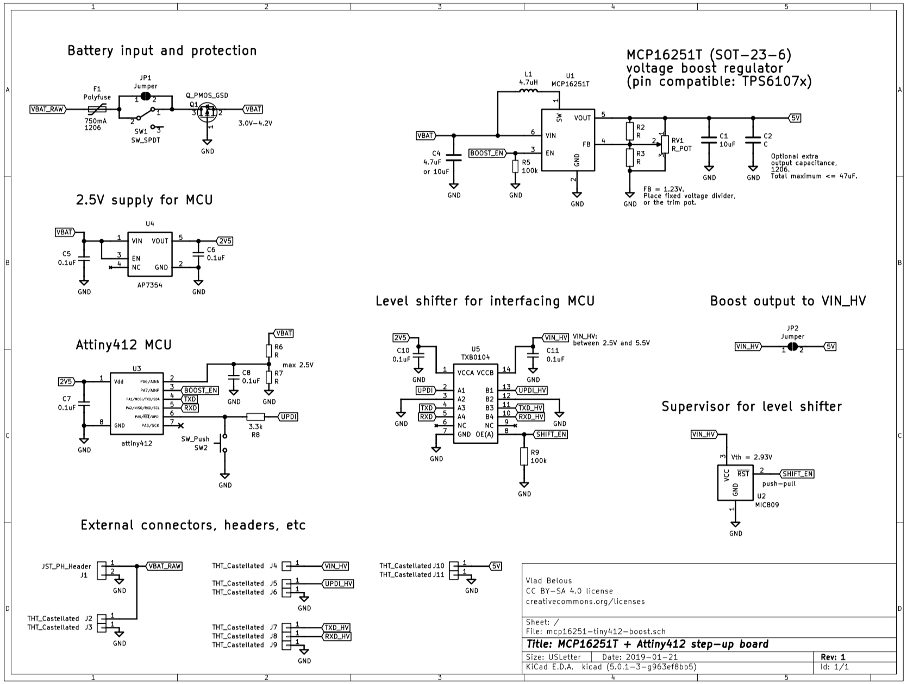
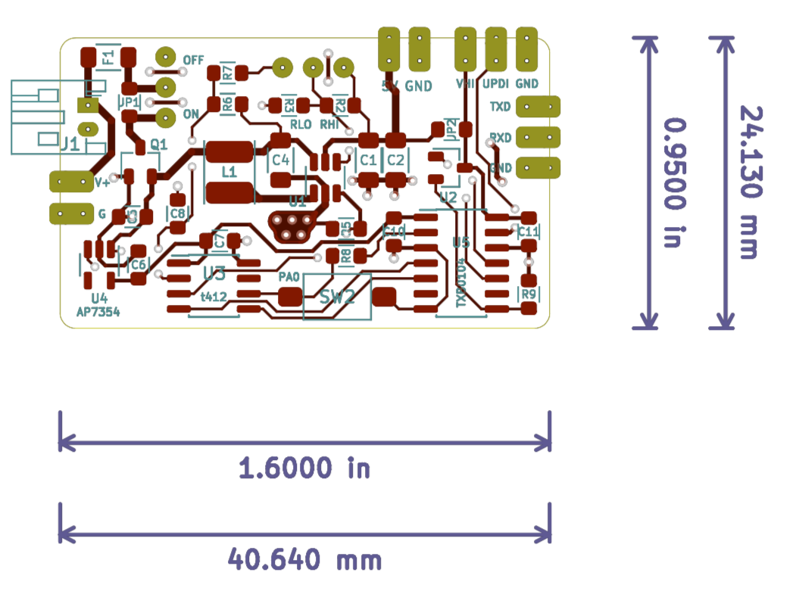
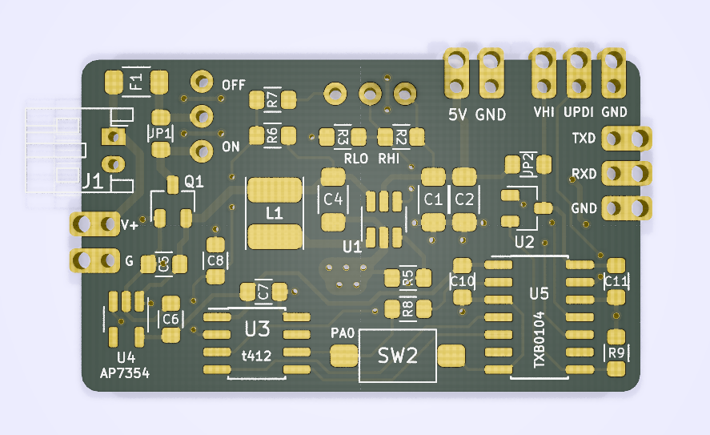

# "Programmable" MCP16251 boost converter with Attiny412 control

MCP16251 

PCB for MCP16251 ([datasheet](http://ww1.microchip.com/downloads/en/devicedoc/20005173b.pdf)) voltage boost regulator, made "smarter" by the addition of a small ATTINY412 MCU:
* MCU's pin PA7 controls EN input pin of the boost regulator, allowing a very low power "sleep" / stand-by.
* Pin PA6 can be used to measure input voltage (VBAT). This can be used to protect battery from over-discharge.
* UPDI pin is broken out for programming arbitrary user-defined control logic.
* TXD/RXD (UART) pins are broken out for communication with downstream components (e.g. ones powered from the boost output), or just for debugging.
* A user-defined button (3mm x 6mm) pulls PA0/UPDI pin low when pressed. Note that PA0/UPDI pin *can* be used for input.

The MCU is powered through a ultra-low quiescent current 2.5V LDO (AP7354 with 0.6uA max quiescent).
TXB0104 is used for voltage level shifting. MIC809 voltage supervisor ensures TXB0104 is enabled only when VCCB > VCCA.

## Schematic:

## Layout:
Two-layer PCB with all components on front layer.

